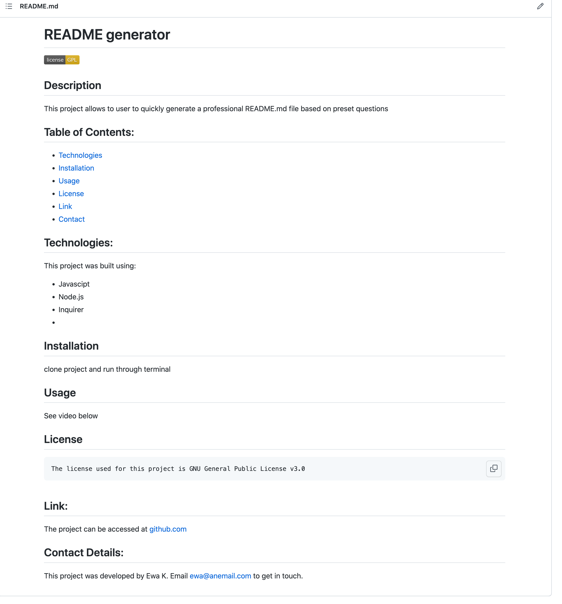

# README generator

## Table of Contents
* <a href="#description"> Project Description</a>
* <a href= "technologies"> Technologies </a>
* <a href="#demonstration" > Demonstration </a>
* <a href ="#link"> Link </a>
* <a href="#contact"> Contact </a>

## Description:
This project allows the user to generate a professional README.md file, by answering a series of present questions based on the most common elements of a good README file. The user is asked to input the project title, a short description, the technologies used to create the project, installation and usage information, as well as a repository link, and developer contact details. The user will also select a license for the project. The input information will be converted into a formatted README file, which can be found in the dist folder.

## Technologies:
This project was built with:

* Inquirer module
* Javascript
* Node.js 

## Demonstration:
To view a demonstration of the application's functionality, please follow <a href="https://watch.screencastify.com/v/q5pmH9zNl4NGpWeztKw8" target="_blank"> this link </a>

The project can be run from the command line.

The README generated with this application will be stored in the /dist folder, and appear similar to the sample image below:

## Link:
The project can be found at <a href="https://github.com/ekubik/README-generator"> https://github.com/ekubik/README-generator </a>

## Contact:
This project was developed by Ewa Kubik - ewa.kubik@hotmail.com
